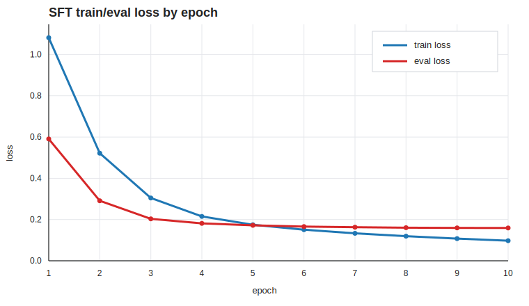
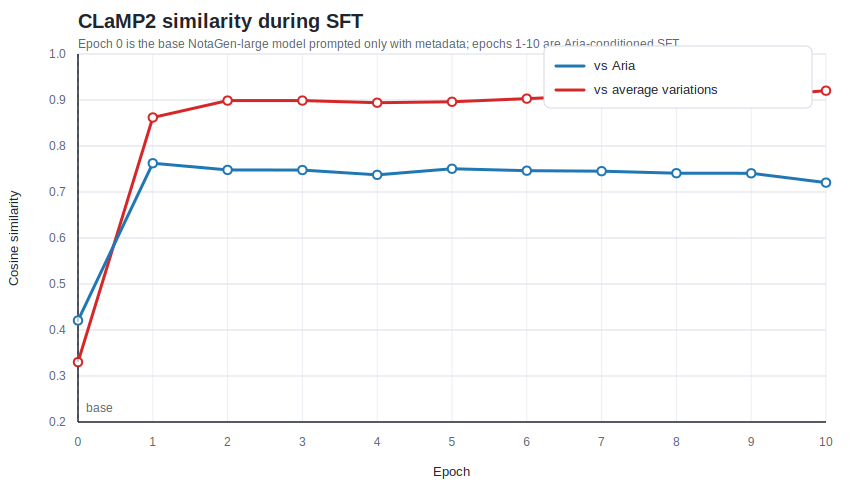
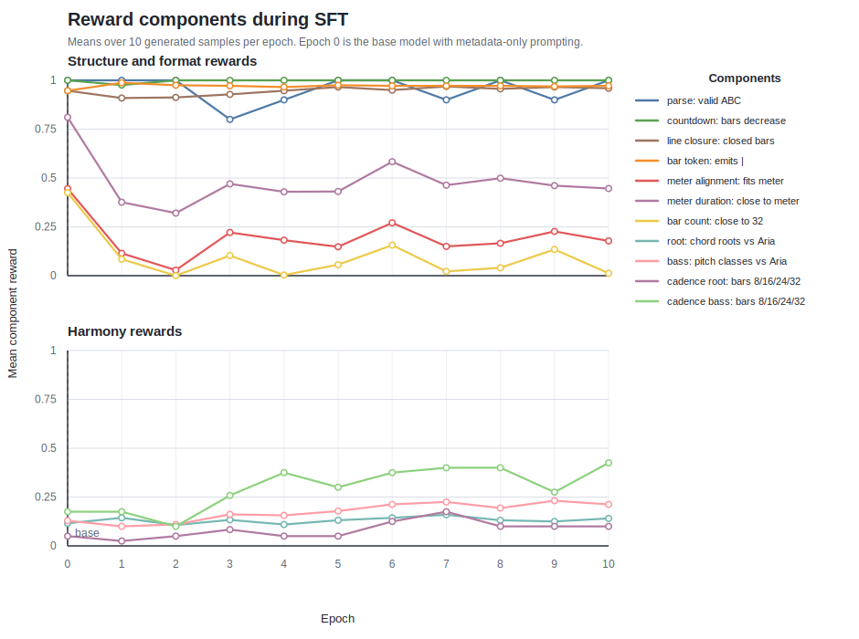
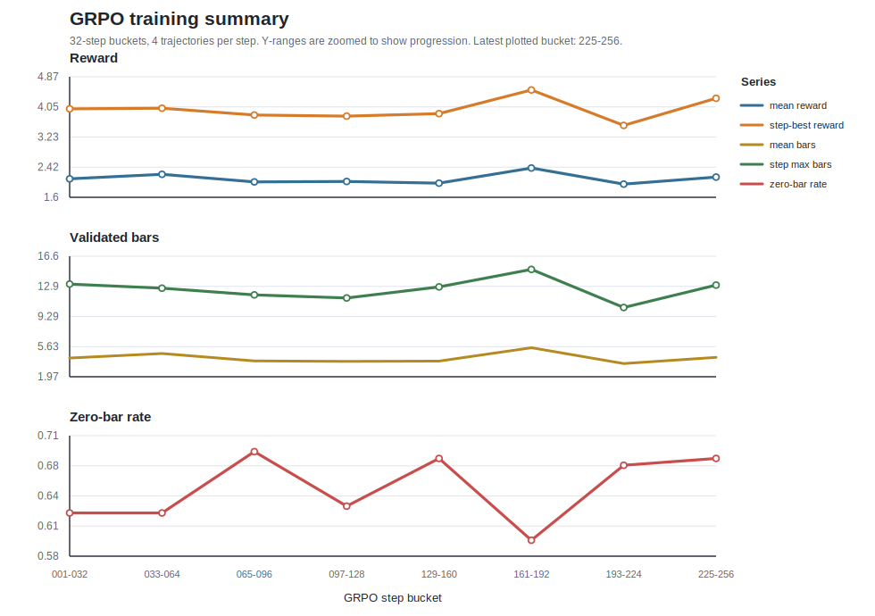
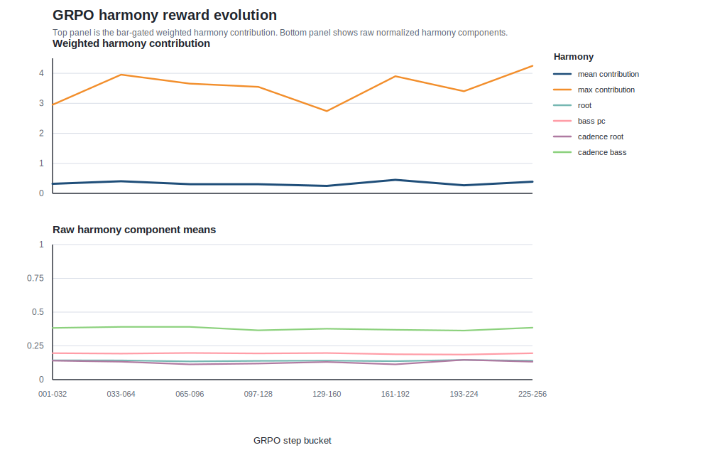

# Infinite Goldberg Variations

Bach's [*Goldberg Variations*](https://open.spotify.com/album/1aCpHSQE5ghxibsQ5gkBe0?si=8XK24O7ZTUShSqC-5yzbNQ) have fascinated listeners and musicians for a long time:
they have something hypnotic and even a bit obsessive, but they are also
delicate and playful, built around a melody that keeps coming and going. I have
come back to them many times during my life, and they still amaze me, so I
thought that, as a music generation exercise, and in a kind of play similar to
the ones suggested in [*Godel, Escher,
Bach*](https://en.wikipedia.org/wiki/G%C3%B6del,_Escher,_Bach), it would be fun
to try to see how other, maybe infinite, variations would sound.

## Why the Goldberg Variations are interesting

The *Goldberg Variations* are composed of an Aria and 30 different variations.
Each variation lasts between a minute and a few minutes  (for a total duration of around an hour), no more than six, and
each one is independent from the others: it starts from scratch, rather than as
a continuation of the previous variation. At the same time, all of them remain
tied to the main Aria. In particular, they share a very strong structure: the
same number of bars, the same broad harmonic plan, and the same large-scale
shape. But inside those constraints, each variation has its own texture, rhythm,
and character.

You can listen to the Aria here:

https://github.com/user-attachments/assets/fa3557df-cc84-4e95-8cbd-53407603f8d6

## Beyond semantic similarity

They also give us an interesting playground to explore the concept of
similarity. When similarity is defined through an embedding trained in a
text/music contrastive way, or through user-preference/music data, as in
[CLaMP 2](https://arxiv.org/abs/2410.13267), it has a basically semantic
meaning: it can capture period, country, genre, or vibe. But it does not
necessarily include much information about similarity in structure, harmony, or
shared themes. Those similarities are much more granular and instance-based:
two pieces can both sound Baroque while having completely different phrase
structures, bass motion, cadences, or relationships to a starting theme. In the
Goldberg Variations, this distinction matters because the interesting question
is not only whether a generated piece sounds like Bach in general, but whether
it behaves like another variation of this particular Aria.

I still have not been able to come up with a clean definition of this more
intrinsic similarity. For now, I approximate it with concrete rule-based
patterns: does the generated piece follow the same structure, does it have the
same number of bars, does the harmony move in the same way, and does it preserve
the relationship to the Aria?

I also define rule-based similarity to the Aria through:

- whether the generated piece has the expected number of bars
- whether the emitted bars align with the declared meter
- whether the inferred harmonic roots follow the Aria
- whether the bass pitch classes follow the Aria
- whether important cadence bars land on similar roots and bass notes

## Modelling

I have used [NotaGen-large](https://arxiv.org/abs/2502.18008) as the
pre-trained base model, since it seems to be the state of the art for symbolic
classical music generation, and Bach and the Baroque period are well represented
in its training set. With that model, I do Aria-conditioned supervised
fine-tuning: the prompt contains the conditioning keywords `%Baroque`, `%Bach,
Johann Sebastian`, and `%Keyboard`, as well as the Aria, while each real
variation is used as the target continuation. This is very consistent with the
concept of a variation.

There is an important caveat here: NotaGen's full pre-training corpus and the
internal part of its fine-tuning data are not released, so I cannot completely
rule out that BWV 988 was already seen by the base model. The public
fine-tuning sources I checked do not seem to contain the Goldberg Variations as
sheet data, but some large MIDI sources do contain them, so I treat this as a
possible contamination risk rather than a settled point.

Since the amount of training data is small, I keep a very low learning rate
(`1e-6`) and use a k-fold-style cross-validation setup, keeping roughly 10-20% of the
variations in the test set and computing token-level log loss on them. The
results are quite consistent across splits: the test loss improves quickly and
then mostly plateaus, while clear overfitting only starts to appear around epoch
10.

In order to understand similarity, I monitor the semantic similarity given by
the CLaMP2 embedding, both to the Aria and to the average embedding of the real
variations, using 10 randomly sampled trajectories for each epoch.

Even with this simple SFT setup and only 1 epoch, the generated samples move
much closer to both the Aria and the average embedding of the real variations.
However, they do not seem to improve much over later epochs. Here epoch 0 is
the base NotaGen-large model prompted only with the metadata keywords, without
the Aria in the prompt.

SFT seems to be worsening some of the meter metrics. This is probably because
the model is mixing up the tempo indication of the prompted Aria with the
variation continuation, so maybe there is a quick fix. However, the harmony
metrics remain quite stable, and some of them, such as cadence bass, improve
with more epochs.

At this point, and for epochs 8 - 9 we can already generate some relatively
decent melodies, that for sure sound baroque and Bach but also are similar to
some of the variations, or at least one can have reminiscences of the theme.
This one is similar to the fifth variation:

https://github.com/user-attachments/assets/1c8b07e3-0f19-4afa-a38d-0aac39d53ce6

For comparison, this is the real fifth variation:

https://github.com/user-attachments/assets/0deb5544-7d33-4a89-ab0f-9d2363995b88

And this one is a bit more dreamy and free:

https://github.com/user-attachments/assets/eb4a3cf9-9998-4410-9401-e3708356828f

Both of them are still very unrefined versions, with harmonic problems, where
the initial counterpoint ends up becoming very messy and without a very clear
structure, but it is a beginning.

### RL through GRPO

Something I have been curious about is whether reinforcement learning can push
the model toward these structural rules more directly. I am trying Group
Relative Policy Optimization (GRPO), introduced in
[DeepSeekMath](https://arxiv.org/abs/2402.03300), because it works well when
the reward is easy to check automatically, as in math or logic tasks. This
feels closer to this project than preference modelling, which has not worked
especially well for music generation so far
([arXiv:2504.16839](https://arxiv.org/pdf/2504.16839)).

The reward is a weighted sum of rule checks: ABC parse validity, countdown and
line structure, bar emission, meter consistency, closeness to 32 bars, harmonic
root similarity to the Aria, bass pitch-class similarity, and cadence root/bass
matches. Harmony rewards are scaled by how much of the 32-bar structure was
actually validated, so tiny fragments do not get full credit.

The current run uses NotaGen-large with a frozen reference model for KL, LoRA
(`r=8`, `alpha=16`, dropout `0.05`), 4 trajectories per prompt, 32 target
stream lines, learning rate `2e-6`, KL coefficient `0.02`, bf16 precision, and
cached rollout/replay chunking to keep long continuations in memory. Checkpoints
are saved every step, with periodic optimizer checkpoints for resuming.

Here is the current reward evolution snapshot. It is still shaky because of the
large variance, but after grouping the steps the ascending trend is quite clear:

The harmony view is a bit more subtle: the raw harmony components are fairly
flat, while the actual weighted harmony contribution mostly moves with how much
valid 32-bar structure the model produces:

Qualitatively, the melodies produced after RL also seem to have a much more
coherent large-scale structure. For example, this fixed render from step 171 has
a clear two-part form, and each part splits again into two subparts, which is
close to the phrase layout of the Aria:

https://github.com/user-attachments/assets/56f300b6-9181-48f5-94d3-d57fa0cb6746

Another good example is this high-reward render from step 54:

https://github.com/user-attachments/assets/87f1db78-1f7f-4797-9659-eb4514aa9d66

A more imperfect one, with some mistakes but where the Aria theme is very easy
to identify and stands out, is this mid-range render from step 253:

https://github.com/user-attachments/assets/def7095a-93e8-4cf1-8791-d05a1c3d880d

Making NotaGen work with GRPO is already a challenge because its decoding is
hierarchical: patch-level generation, token-level generation, and replayed
log-probability scoring all have to stay aligned. Long 32-bar continuations can
also contain many token events, so this is still a WIP.

### Next steps

There are many follow-ups that come to mind. Continuing with this setup, maybe
the most interesting one is to build a more structural embedding, something
that takes all these rules into account and can be used as a pure similarity
reward, in the same spirit that [NotaGen](https://arxiv.org/abs/2502.18008)
uses a semantic embedding.

That said, I am not even sure that post-training is the best place to force all
of this. Ideally, the base model should be conditioned on a concrete melody,
not only on generic metadata like author and period. That would make it possible
to learn these structural representations for any piece, instead of adding them
after the fact for this particular setup.
