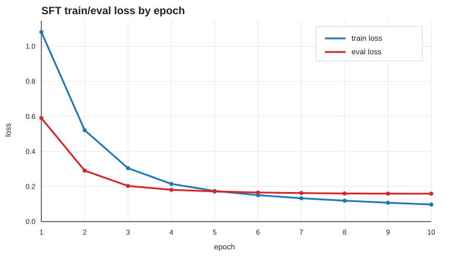
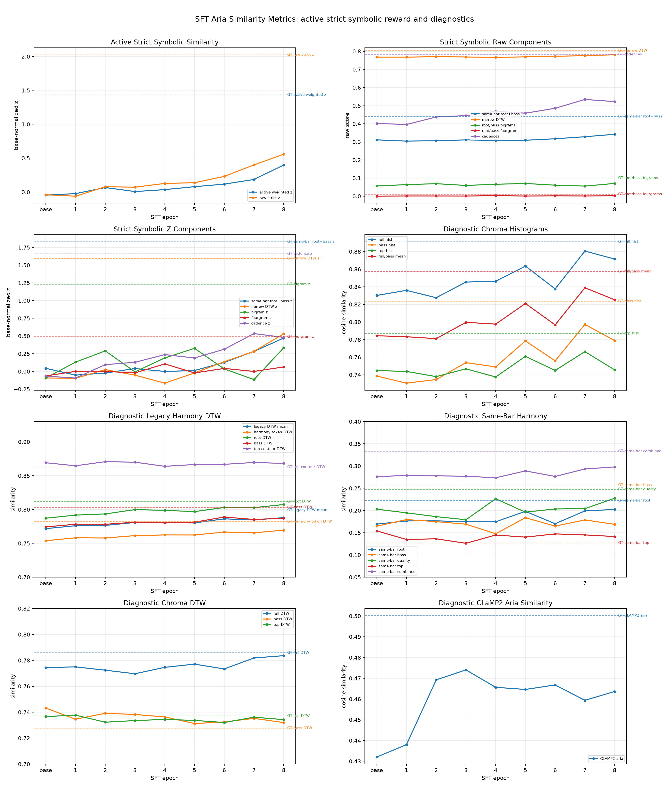
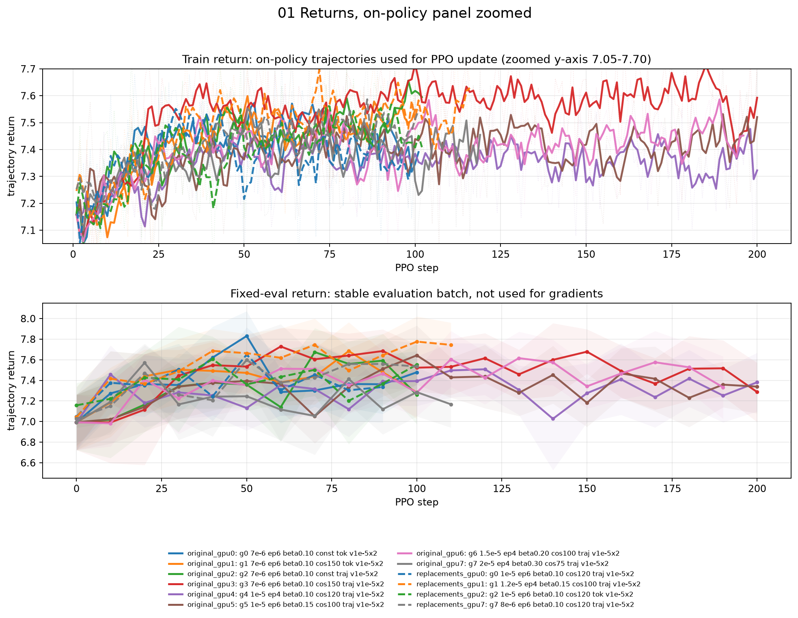
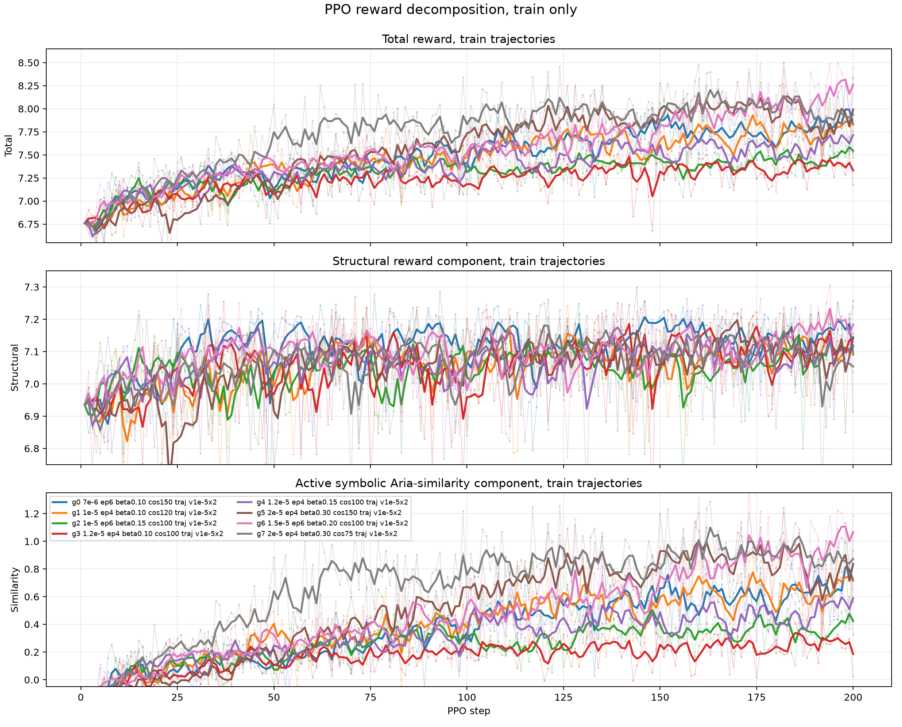
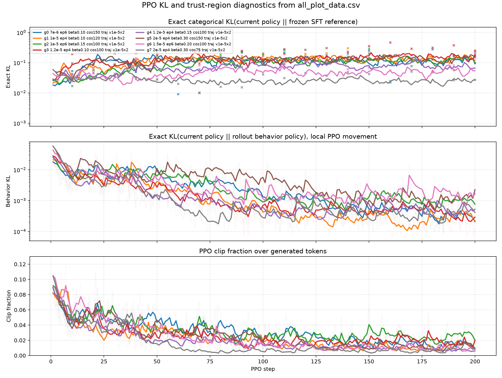

# Infinite Goldberg Variations

## TL;DR

We play at being Baroque god (Bach) and train a music
model based on [NotaGen](https://arxiv.org/abs/2502.18008) to generate
infinitely many new
[*Goldberg Variations*](https://en.wikipedia.org/wiki/Goldberg_Variations).
I try some of the RL post-training methods that work for text in the context of
music, by having rewards that try to make the generated piece similar to the
Goldberg Aria, structurally, harmonically, musically. The original Aria sounds like:

https://github.com/user-attachments/assets/fa3557df-cc84-4e95-8cbd-53407603f8d6

These are some examples of the result. One takes the initial notes and copies
the harmony, but develops something completely different:

https://github.com/user-attachments/assets/28d7d45f-7496-45b5-98e6-843f47b4fb1c

Another produces a different melody, but keeps the same structure and has
subtle reminiscences of certain parts:

https://github.com/user-attachments/assets/56f300b6-9181-48f5-94d3-d57fa0cb6746

Others take the start of some of the real variations, but then develop them by
fusing them with the Aria:

https://github.com/user-attachments/assets/427a07cf-7f30-42b5-bd7c-acb23ebce884

https://github.com/user-attachments/assets/b8bf218d-3af3-4be6-90ad-04f487520ba0

Others copy the Aria theme almost literally, but add different harmonizations:

https://github.com/user-attachments/assets/7bcd20ce-b491-487b-b384-a615286e707f

This other one has quite a different left hand:

https://github.com/user-attachments/assets/e6d5aca0-998b-4b6c-9272-4e3b9b583a81

And others are more free, but still have quite a lot of similarities:

https://github.com/user-attachments/assets/87f1db78-1f7f-4797-9659-eb4514aa9d66

## The Variations

Bach's [*Goldberg Variations*](https://open.spotify.com/album/1aCpHSQE5ghxibsQ5gkBe0?si=8XK24O7ZTUShSqC-5yzbNQ) have fascinated listeners and musicians for a long time:
they have something hypnotic and even a bit obsessive, but they are also
delicate and playful, built around a melody that keeps coming and going. I have
come back to them many times during my life, and they still amaze me, so I
thought that, as a music generation exercise, and in a kind of play similar to
the ones suggested in [*Godel, Escher,
Bach*](https://en.wikipedia.org/wiki/G%C3%B6del,_Escher,_Bach), it would be fun
to try to see how other, maybe infinite, variations would sound.

## Why the Goldberg Variations are interesting

The *Goldberg Variations* are composed of an Aria and 30 different variations.
Each variation lasts between a minute and a few minutes, no more than six, for
a total duration of around an hour. Each one is independent from the others: it
starts from scratch, rather than as a continuation of the previous variation.
At the same time, all of them remain
tied to the main Aria. In particular, they share a very strong structure: the
same number of bars, the same broad harmonic plan, and the same large-scale
shape. But inside those constraints, each variation has its own texture, rhythm,
and character.

You can listen to the Aria here:

https://github.com/user-attachments/assets/fa3557df-cc84-4e95-8cbd-53407603f8d6

## Beyond semantic similarity

They also give us an interesting playground to explore the concept of
similarity. When similarity is defined through an embedding trained in a
text/music contrastive way, or through user-preference/music data, as in
[CLaMP 2](https://arxiv.org/abs/2410.13267), it has a basically semantic
meaning: it can capture period, country, genre, or vibe. But it does not
necessarily include much information about similarity in structure, harmony, or
shared themes. Those similarities are much more granular and instance-based:
two pieces can both sound Baroque while having completely different phrase
structures, bass motion, cadences, or relationships to a starting theme. In the
Goldberg Variations, this distinction matters because the interesting question
is not only whether a generated piece sounds like Bach in general, but whether
it behaves like another variation of this particular Aria.

I am still iterating on clean definitions of this more intrinsic similarity.
For now, it is based on different local and global comparisons of the Aria's
harmony and structure with those of the generated piece. Some of these signals
are global, such as pitch-class histogram similarity after normalizing pieces
to a common key. Others are more local, comparing bass motion, top-voice
behavior, harmonic roots, and bar-level harmony against the Aria with simple
alignment rules. None of this is a complete musical definition, but it gives a
more concrete signal for whether the generated piece behaves like another
variation of the Goldberg Aria, rather than only sounding generically Baroque.

## Modelling

I have used [NotaGen-large](https://arxiv.org/abs/2502.18008) as the
pre-trained base model, since it seems to be the state of the art for symbolic
classical music generation, and Bach and the Baroque period are well represented
in its training set. With that model, I do supervised fine-tuning where the
prompt contains the conditioning keywords `%Baroque`, `%Bach, Johann Sebastian`,
and `%Keyboard`, together with the ABC header for the target variation, while
each real variation is used as the target continuation. I initially also tried
putting the Aria itself in the prompt, which is conceptually natural for a
variation task, but I discarded that setup because it made the prompt much
longer, made the continuation structure less stable, and did not improve the
results enough to justify the extra complexity.

There is an important caveat here: NotaGen's full pre-training corpus and the
internal part of its fine-tuning data are not released, so I cannot completely
rule out that BWV 988 was already seen by the base model. The public
fine-tuning sources I checked do not seem to contain the Goldberg Variations as
sheet data. There is still a risk that some MIDI files in pre-training contain
them, although this is not the most likely explanation because the prompt is
generic and does not contain anything specific to the Goldberg Variations. I
keep sanity metrics on the base model, before fine-tuning and under the same
prompt, to check that it is generating generic Bach-like music rather than
material that is already close to the Aria.

Since the amount of training data is small, I keep a very low learning rate
(`1e-6`) and use a k-fold-style cross-validation setup, keeping roughly 10-20% of the
variations in the test set and computing token-level log loss on them. The
results are quite consistent across splits: the test loss improves quickly and
then mostly plateaus, while clear overfitting only starts to appear around epoch
10.

In order to understand similarity, I monitor CLaMP2 semantic similarity, but the
more important part is a set of symbolic similarity measures between the
generated variation and the Aria. Some of these metrics are used later as RL
optimization terms, which is why I also refer to them as rewards.

These measures include global comparisons, such as pitch-class histograms, and
local comparisons bar by bar, both with exact bar positions and with a narrow
DTW alignment that allows small local shifts. For each bar, I infer simple
harmonic signals from the voices, especially root and bass pitch classes, and
then compare the generated sequence with the Aria's harmonic skeleton.

I also check key structural points, such as phrase endings and cadences, and use
weighted Jaccard overlap to ask whether short root/bass progressions from the
Aria reappear in the generated piece. To check whether these measures are
meaningful with respect to what Bach treated as a similar variation, I also
compute them on the real Goldberg variations. The useful metrics are the ones
where the ground-truth variations are clearly harder to match than the base
model and the first SFT versions.

Values are reported as `baseline / epoch 1 / epoch 8 / Bach GT`.

| Similarity signal | What it compares | Use | Values |
|---|---|---|---:|
| CLaMP2 whole-piece embedding (`clamp2_aria`) | A learned semantic similarity score between the whole generated piece and the Aria. This is useful as a broad diagnostic, but it is not the main reward because it is less explicit about harmony and form. | Whole-sequence diagnostic, logged only | `0.432 / 0.438 / 0.464 / 0.500` |
| Active symbolic Aria score (`aria_strict_symbolic_component_global_base_z`) | The main similarity reward. It combines the local checks below and standardizes them against base-model samples, so positive values mean the piece is more Aria-like than the base model usually is. | End-of-sequence active reward | `-0.044 / -0.022 / 0.398 / 1.434` |
| Same-bar harmony (`strict_aligned_root_bass`) | Compares each generated bar with the same-position Aria bar. All voices in the bar are collapsed to infer the chord root, and the bass is taken from the lowest note; the other voices affect the inferred harmony but are not scored as separate voices. This rewards matching the local harmonic skeleton without requiring the exact surface notes. | Active component | `0.311 / 0.304 / 0.342 / 0.440` |
| Flexible harmonic path (`strict_dtw_combined_narrow`) | Aligns the generated bar sequence to the Aria with a narrow DTW window, so small local shifts are allowed but the piece still has to follow roughly the same harmonic route. | Active component | `0.768 / 0.768 / 0.781 / 0.804` |
| Repeated harmonic patterns, 2-bar / 4-bar (`strict_root_bass_*gram_weighted_jaccard`) | Looks for short root/bass progressions from the Aria inside the generated piece. The 2-bar version is looser; the 4-bar version is stricter and therefore much smaller. | Active component | `0.056 / 0.064 / 0.071 / 0.100` for 2-bar; `0.000 / 0.001 / 0.003 / 0.011` for 4-bar |
| Phrase endings (`strict_cadence_root_bass`) | Compares root and bass at cadence positions, where matching the Aria's harmonic arrivals is especially important. | Active component | `0.402 / 0.396 / 0.522 / 0.783` |
| Global pitch-class color, all notes / bass / top voice (`aria_chroma_*_hist`) | Compares the overall distribution of pitch classes after key normalization. The three variants use all notes, only the bass, and only the highest voice. | Whole-sequence diagnostic, logged only | all notes: `0.830 / 0.836 / 0.871 / 0.891`; bass: `0.739 / 0.731 / 0.779 / 0.824`; top: `0.745 / 0.744 / 0.746 / 0.787` |
| Pitch-class sequence, all notes / bass / top voice (`aria_chroma_*_dtw`) | Compares the order of pitch-class profiles through the piece, again after key normalization. Unlike the histogram score, this keeps some time ordering by aligning the generated sequence to the Aria with DTW. | Whole-sequence diagnostic, logged only | all notes: `0.774 / 0.775 / 0.784 / 0.786`; bass: `0.743 / 0.735 / 0.732 / 0.728`; top: `0.737 / 0.738 / 0.734 / 0.737` |
| Broad DTW harmony diagnostics, combined / root / bass (`aria_harmony_*_dtw`) | Older, looser DTW alignment metrics. They compare the bar-level harmonic sequence using all inferred harmony features together, only chord roots, or only bass notes. | Patch-level diagnostic, logged only | combined: `0.772 / 0.776 / 0.788 / 0.799`; root: `0.787 / 0.792 / 0.807 / 0.812`; bass: `0.774 / 0.778 / 0.787 / 0.803` |
| Direct same-bar diagnostics, root / bass (`aria_harmony_aligned_*`) | Older direct bar-position matches for chord root and bass. These are logged separately from the stricter active same-bar reward. | Patch-level diagnostic, logged only | root: `0.169 / 0.176 / 0.202 / 0.222`; bass: `0.165 / 0.180 / 0.169 / 0.257` |
| Top-voice contour (`aria_harmony_top_contour_dtw`) | Compares whether the highest voice broadly moves up, down, or stays level in a similar sequence to the Aria. | Patch-level diagnostic, logged only | `0.869 / 0.865 / 0.868 / 0.863` |

Even with this simple SFT setup, the generated samples move closer to the Aria
on several of these signals, but the picture is mixed across the full
similarity bundle, and later improvements sometimes come at the expense of a
very high KL distance from the base model. I compute this KL exactly over the
symbol distribution rather than with a sampled approximation. The active
similarity reward is the strict symbolic Aria-similarity aggregate normalized
against base-model samples. I keep CLaMP2,
chroma histogram and chroma DTW, the older broader harmony DTW and same-bar
alignment metrics, top-voice contour DTW, and density DTW as diagnostics. Here
the base model is NotaGen-large prompted with the same metadata/header prompt,
without the Aria in the prompt.

At this point, around epoch 8, the model can already generate some
relatively decent melodies that sound Baroque and Bach-like, and that are also
similar to some of the variations, or at least contain clear echoes of the
theme.
This one is similar to the fifth variation:

https://github.com/user-attachments/assets/1c8b07e3-0f19-4afa-a38d-0aac39d53ce6

For comparison, this is the real fifth variation:

https://github.com/user-attachments/assets/0deb5544-7d33-4a89-ab0f-9d2363995b88

And this one is a bit more dreamy and free:

https://github.com/user-attachments/assets/eb4a3cf9-9998-4410-9401-e3708356828f

Both of them are still very unrefined, with harmonic problems where the initial
counterpoint becomes messy and loses a clear structure, but it is a beginning.

### RL through PPO

Something I have been curious about is whether reinforcement learning can push
the model toward these structural rules more directly. I am now experimenting
with [Proximal Policy Optimization](https://arxiv.org/abs/1707.06347). The
setup is close to the standard RLHF loop: generate continuations from the
current policy, score them with automatic rewards, estimate advantages with a
value function, and update the policy with the clipped PPO objective.

The useful part of this setup is that the rewards are rule-based, so they are
cheap to compute and do not require human preference labels in the loop. Some
of them are also naturally local: instead of giving only one terminal reward at
the end of the whole variation, meter, line-structure, bar-count, and harmony
signals can be attributed at the patch or bar level, which gives PPO a denser
training signal.

The reward is a weighted sum of structural checks and Aria-similarity checks.
The active similarity side uses the strict symbolic Aria-similarity aggregate
defined above; chroma histograms and the older non-strict harmony DTW terms are
retained as diagnostics.

I keep the structural rewards as safeguards. They prevent the policy from
improving an Aria-similarity metric by exploiting broken notation, malformed
meter, wrong continuation length, empty lines, or other reward-hacking paths
that would not produce a usable score. These structural checks cover ABC
validity, NotaGen line structure, meter consistency, written musical bars, and
repeat-expanded rendered bars.

The table below lists only active structural reward terms, using the same
convention as the similarity table. Values are reported as `baseline / epoch 1
/ epoch 8 / Bach GT`. Individual rows show mean raw subreward scores before
applying the listed weight; the subtotal row is already a weighted sum.

| Structural signal | What it checks | Use | Values |
|---|---|---|---:|
| Written completion (`completion_reward`) | Whether the continuation reaches the target written score-measure count, usually 32 Goldberg measures. | Terminal active reward, weight `0.250` | `1.000 / 0.967 / 1.000 / 0.900` |
| Rendered completion (`expanded_completion_reward`) | Whether repeat expansion gives the target rendered score-measure count, usually 64 measures after repeats. | Terminal active reward, weight `0.250` | `0.500 / 0.417 / 0.583 / 0.900` |
| ABC parse quality (`parse_reward`) | A graded syntax score across balanced constructs, inline fields, duration sanity, tokenizer success, and music21 parsing. | Terminal active reward, weight `0.250` | `0.993 / 0.923 / 0.950 / 1.000` |
| Malformed syntax penalty (`syntax_penalty_reward`) | Fast preflight detection of clearly malformed ABC patterns. Negative values mean the penalty was triggered. | Terminal active penalty, weight `0.250` | `0.000 / -0.100 / -0.083 / 0.000` |
| NotaGen countdown (`countdown_reward`) | Whether generated stream lines follow the expected `[r:i/j]` countdown progression. | Patch-attributed active reward, weight `0.250` | `1.000 / 0.999 / 1.000 / 1.000` |
| Stream-line closure (`line_closure_reward`) | Whether generated stream lines close syntactically instead of leaving open fragments. | Patch-attributed active reward, weight `0.250` | `1.000 / 0.999 / 1.000 / 1.000` |
| Bar-token presence (`bar_token_reward`) | Whether stream lines contain ABC bar or repeat markers. | Patch-attributed active reward, weight `0.100` | `1.000 / 1.000 / 1.000 / 1.000` |
| Note-bearing lines (`note_bearing_line_reward`) | Whether generated stream lines contain at least one note in some voice, so empty or rest-only lines lose a small amount of credit. | Patch-attributed active reward, weight `0.250` | `1.000 / 0.990 / 0.997 / 1.000` |
| Meter alignment (`meter_alignment_reward`) | Whether populated voices fill the expected duration implied by the current meter. | Patch-attributed active reward, weight `0.750` | `0.969 / 0.927 / 0.974 / 0.987` |
| Meter-duration closeness (`meter_duration_closeness_reward`) | How close generated bar durations are to the expected meter, with partial credit for near misses. | Patch-attributed active reward, weight `0.750` | `0.996 / 0.964 / 0.997 / 0.994` |
| Cross-voice meter consistency (`bar_meter_consistency_reward`) | Whether voices inside the same generated bar agree on duration. | Patch-attributed active reward, weight `0.750` | `0.970 / 0.939 / 0.997 / 0.997` |
| Written bar count (`bar_count_reward`) | Graded closeness to the target written score-measure count, separate from repeat expansion. | Patch-marginal active reward, weight `1.000` | `1.000 / 0.999 / 1.000 / 0.902` |
| Repeat-expanded bar count (`expanded_bar_count_reward`) | Graded closeness to the target rendered measure count after accounting for repeat syntax. | Patch-marginal active reward, weight `1.000` | `0.764 / 0.757 / 0.834 / 0.899` |
| Voice declarations (`voice_declaration_reward`) | Whether generated voice references are declared in the ABC header. | Patch-attributed active reward, weight `1.000` | `1.000 / 1.000 / 1.000 / 1.000` |
| Score voice set (`score_voice_reward`) | Whether generated voices match the `%%score` voice set expected by the prompt. | Patch-attributed active reward, weight `0.500` | `1.000 / 1.000 / 1.000 / 1.000` |
| Structural subtotal (`structural_total_reward`) | Weighted sum of the active structural checks above. This is the structural contribution before adding Aria-similarity reward. | Mixed active subtotal | `6.939 / 6.777 / 7.023 / 7.084` |

In the current PPO implementation, rewards and value targets are computed per
NotaGen patch for tractability, while the policy loss is reduced over generated
character tokens. Patch-level advantages are repeated over the generated tokens
inside each patch, prompt tokens are excluded from the loss, and Generalized
Advantage Estimation controls how rewards are propagated through the trajectory.
An exact full-vocabulary KL against the frozen SFT/reference policy can be
logged or used as a penalty.

The current PPO sweeps vary the learning rate, the number of PPO epochs per
rollout batch, the reference-KL penalty coefficient, the learning-rate schedule,
and whether the token loss is reduced with a token-uniform or
trajectory-balanced mean. In the latest 200-step sweep, the strongest final
fixed-eval run uses `lr=1.5e-5`, `ppo_epochs=6`, `reference_kl_coef=0.20`,
cosine decay over 100 steps, trajectory-balanced token reduction, and two
post-update value-head epochs. On the fixed evaluation set, that run improves
total reward from `7.049` to `8.311`, and the active symbolic Aria-similarity
reward from `0.022` to `1.049`. The final train-state exact KL to the SFT
reference is `0.053`; the matching fixed-eval exact KL is `0.147`.

The train-only component plot zooms the on-policy structural and similarity
subrewards, so the component movement is easier to see. It shows that the
reward increase is not only a structural formatting gain: the active similarity
component rises substantially in the better controlled runs. The highest
intermediate fixed-eval point in this sweep reaches `8.356` at step 140, but
then falls back to `8.129` by step 200. I therefore still prefer runs that
improve reward together with controlled reference KL and stable fixed-eval
behavior, rather than selecting the single highest checkpoint.

The KL plot uses a log-scale y-axis. The top panel is the exact categorical KL
between the current policy and the frozen SFT reference over the full symbol
distribution, not a sampled-action approximation. The lower panels track local
exact KL movement from the rollout behavior policy and the PPO clip fraction.
Those lower panels are zoomed to the observed range so small trust-region
changes remain visible. This separation matters: the behavior KL can stay small
while cumulative drift from the SFT reference keeps growing.

Some qualitative renders from earlier RL runs are still useful as examples of
what this reward-driven stage is trying to improve, independent of whether the
policy update is done with GRPO or PPO. For example, this fixed render from
step 171 has a clear two-part form, and each part splits again into two
subparts, which is close to the phrase layout of the Aria:

https://github.com/user-attachments/assets/56f300b6-9181-48f5-94d3-d57fa0cb6746

And this one has the first notes of the beginning of each part, but then it
evolves them in a nice way:

https://github.com/user-attachments/assets/fd759a4e-45c8-4795-aa50-34744582e7f5

This is an even better version of that same idea:

https://github.com/user-attachments/assets/427a07cf-7f30-42b5-bd7c-acb23ebce884

This one seems like a variation of the first variation, but with very
interesting harmony and a second theme:

https://github.com/user-attachments/assets/b8bf218d-3af3-4be6-90ad-04f487520ba0

Or these two, where the melody is almost the same as the Aria. This is when PPO
starts making reward hacking visible, but it develops the material in very
interesting, and sometimes almost Frankenstein-like, ways:

https://github.com/user-attachments/assets/7bcd20ce-b491-487b-b384-a615286e707f

This other one has quite a different left hand:

https://github.com/user-attachments/assets/e6d5aca0-998b-4b6c-9272-4e3b9b583a81

Another good example is this high-reward render from step 54:

https://github.com/user-attachments/assets/87f1db78-1f7f-4797-9659-eb4514aa9d66

A more imperfect one, with some mistakes but where the Aria theme is easier to
identify, is this mid-range render from step 253:

https://github.com/user-attachments/assets/def7095a-93e8-4cf1-8791-d05a1c3d880d

Making NotaGen work with PPO is already a challenge because its decoding is
hierarchical: patch-level generation, token-level generation, replayed
log-probability scoring, and value prediction all have to stay aligned. Long
32-bar continuations can also contain many token events, so this is still a
WIP.

### Next steps

There are many follow-ups that come to mind. Continuing with this setup, maybe
the most interesting one is to build a more structural embedding, something
that takes all these rules into account and can be used as a pure similarity
reward, in the same spirit that [NotaGen](https://arxiv.org/abs/2502.18008)
uses a semantic embedding.

That said, I am not even sure that post-training is the best place to force all
of this. Ideally, the base model should be conditioned on a concrete melody,
not only on generic metadata like author and period. That would make it possible
to learn these structural representations for any piece, instead of adding them
after the fact for this particular setup.
